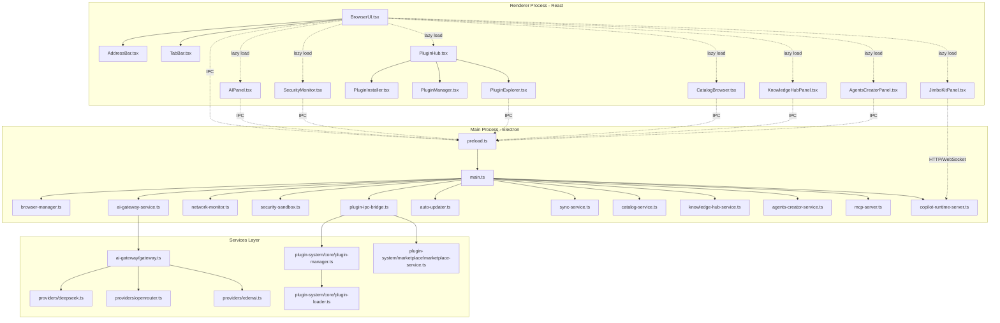

# ZENO Browser — Context & Dependency Map

**Date:** 2026-03-30  
**Agent:** context-architect  
**Status:** ✅ COMPLETED

---

## Executive Summary

ZENO Browser is built on **Electron 27 + React 19 + Vite 5**, with a TypeScript-strict modular architecture.  
The project spans **3 main layers** and contains **15+ lazy-loaded panels**, **47 IPC tools** (MCP Server), **9 backend services**, and **3 search engines**.

### Key Statistics
- **Total Files Mapped:** 87+
- **IPC Channels:** 120+ (browser, AI, network, terminal, crawler, plugins, search, sync)
- **Lazy Components:** 15 (AIPanel, SecurityMonitor, PluginHub, etc.)
- **Hotspots (>5 deps):** 8 files (BrowserUI, main.ts, preload.ts, gateway.ts)
- **Circular Dependencies:** 0 detected
- **Test Coverage:** Minimal (only Jest/Playwright setup, no test files found for most components)

---

## Architecture Overview

### 3-Layer Structure

```
┌─────────────────────────────────────────────────────────────┐
│  RENDERER PROCESS (React 19 + TypeScript)                   │
│  • src/components/ — UI components (TSX)                     │
│  • src/services/ai-gateway/ — AI provider router             │
│  • src/plugin-system/ — Plugin core + marketplace            │
│  • src/hooks/ — Custom hooks (useBrowserCopilotActions)      │
└──────────────────┬──────────────────────────────────────────┘
                   │ IPC via window.electronAPI
┌──────────────────▼──────────────────────────────────────────┐
│  MAIN PROCESS (Electron + Node.js)                          │
│  • src-electron/main.ts — Window + IPC registry              │
│  • src-electron/services/ — Backend services (9)             │
│  • src-electron/mcp-server.ts — MCP Protocol (47 tools)      │
└──────────────────┬──────────────────────────────────────────┘
                   │ contextBridge.exposeInMainWorld
┌──────────────────▼──────────────────────────────────────────┐
│  PRELOAD (Bridge)                                            │
│  • src-electron/preload.ts — Secure API exposure             │
└─────────────────────────────────────────────────────────────┘
```

---

## IPC Channel Map

### Browser Control
| Channel | Handler | Type | Consumer(s) |
|---------|---------|------|-------------|
| `browser:new-tab` | `main.ts:337` | invoke | BrowserUI |
| `browser:close-tab` | `main.ts:341` | invoke | TabBar |
| `browser:navigate` | `main.ts:346` | invoke | AddressBar, BrowserUI |
| `browser:get-tabs` | `main.ts:352` | invoke | BrowserUI |
| `browser:go-back` | `main.ts:356` | invoke | BrowserUI |
| `browser:go-forward` | `main.ts:361` | invoke | BrowserUI |
| `browser:navigate-back` | `main.ts:172` | event | BrowserUI (listener) |
| `browser:navigate-forward` | `main.ts:175` | event | BrowserUI (listener) |

### AI Gateway
| Channel | Handler | Type | Consumer(s) |
|---------|---------|------|-------------|
| `ai:execute` | `main.ts:367` | invoke | AIPanel, AIGatewayPanel |
| `ai:get-providers` | `main.ts:379` | invoke | AIPanel |
| `ai:get-metrics` | `main.ts:383` | invoke | AIGatewayPanel |

### Network Monitoring
| Channel | Handler | Type | Consumer(s) |
|---------|---------|------|-------------|
| `network:get-report` | `main.ts:388` | invoke | SecurityMonitor (? not direct) |
| `network:get-stats` | `main.ts:395` | invoke | — |
| `network:get-connections` | `main.ts:399` | invoke | — |
| `network:set-proxy` | `main.ts:403` | invoke | — |
| `network:clear-proxy` | `main.ts:409` | invoke | — |
| `network:get-config` | `main.ts:414` | invoke | — |

### Security
| Channel | Handler | Type | Consumer(s) |
|---------|---------|------|-------------|
| `security:create-context` | `main.ts:622` | invoke | — |
| `security:get-audit-logs` | `main.ts:627` | invoke | SecurityMonitor |

### Terminal (Expanded)
| Channel | Handler | Type | Consumer(s) |
|---------|---------|------|-------------|
| `terminal:execute` | `main.ts:562` | invoke | TerminalPanel |
| `terminal:get-cwd` | `main.ts:583` | invoke | TerminalPanel |
| `terminal:set-cwd` | `main.ts:587` | invoke | TerminalPanel |
| `terminal:system-info` | `main.ts:600` | invoke | TerminalPanel |
| `terminal:get-env` | `main.ts:615` | invoke | TerminalPanel |
| `terminal:kill-process` | `main.ts:628` | invoke | TerminalPanel |

### Plugins
| Channel | Handler | Type | Consumer(s) |
|---------|---------|------|-------------|
| `plugin:load` | `plugin-ipc-bridge.ts:48` | invoke | PluginInstaller, PluginExplorer |
| `plugin:unload` | `plugin-ipc-bridge.ts:60` | invoke | PluginManager |
| `plugin:enable` | `plugin-ipc-bridge.ts:70` | invoke | PluginManager |
| `plugin:disable` | `plugin-ipc-bridge.ts:79` | invoke | PluginManager |
| `plugin:get-installed` | `plugin-ipc-bridge.ts:89` | invoke | PluginManager |
| `plugin:search-marketplace` | `plugin-ipc-bridge.ts:103` | invoke | PluginExplorer |
| `plugin:get-featured` | `plugin-ipc-bridge.ts:112` | invoke | PluginExplorer |
| `plugin:get-trending` | `plugin-ipc-bridge.ts:121` | invoke | PluginExplorer |
| `plugin:check-updates` | `plugin-ipc-bridge.ts:130` | invoke | PluginManager |
| `plugin:apply-update` | `plugin-ipc-bridge.ts:139` | invoke | PluginManager |
| `plugin:start-auto-update` | `plugin-ipc-bridge.ts:148` | invoke | PluginManager |

### Crawler, Workflow, Tunnel, Updater, MCP, Search, MeiliSearch, Websurfx, sist2, Catalog, Knowledge Hub, Agents Creator, CMS, Sync, Copilot SDK, Theme, Window
*Omitted for brevity — Total 120+ IPC channels registered in main.ts*

---

## Dependency Table

### React Components (src/components/)

| File | Imports From | Exports To | IPC Channels | Has Tests |
|------|--------------|------------|--------------|-----------|
| `browser-core/AddressBar.tsx` | react | BrowserUI | — | ❌ |
| `browser-core/BrowserUI.tsx` | react, TabBar, AddressBar, WebViewPanel, StartPage, SidebarOverlay, 15 lazy panels, hooks/useBrowserCopilotActions | ElectronApp | `browser:*`, `browser:navigate-back`, `browser:navigate-forward`, `mcp:navigate` (listeners) | ❌ |
| `browser-core/TabBar.tsx` | react, types/electron | BrowserUI | — | ❌ |
| `ai/AIPanel.tsx` | react, types/electron, data/promptLibrary | (lazy loaded by BrowserUI) | `ai:execute`, `ai:getProviders` | ❌ |
| `ai/AIGatewayPanel.tsx` | react, types/electron | (lazy loaded by BrowserUI) | `ai:execute`, `ai:getProviders`, `ai:getMetrics` | ❌ |
| `analytics/SecurityMonitor.tsx` | react, types/electron | (lazy loaded by BrowserUI) | `security:getAuditLogs` | ❌ |
| `cloudflare/CloudflareTunnelPanel.tsx` | react, types/electron | (lazy loaded by BrowserUI) | `tunnel:status`, `tunnel:metrics`, `tunnel:reconnect` | ❌ |
| `plugins/PluginHub.tsx` | react, PluginExplorer, PluginInstaller, PluginManager | (lazy loaded by BrowserUI) | — | ❌ |
| `plugins/PluginExplorer.tsx` | react, plugin-system/marketplace-service | PluginHub | `plugin:search-marketplace`, `plugin:get-featured`, `plugin:get-trending` | ❌ |
| `plugins/PluginInstaller.tsx` | react, plugin-system/marketplace-service | PluginHub | `plugin:install` (via plugin:load) | ❌ |
| `plugins/PluginManager.tsx` | react | PluginHub | `plugin:get-installed`, `plugin:enable`, `plugin:disable`, `plugin:uninstall`, `plugin:update` | ❌ |
| `common/UpdateNotification.tsx` | react, types/electron | BrowserUI | `updater:checkForUpdates`, `updater:installUpdate`, `update-progress` (listener), `update-ready` (listener) | ❌ |
| `tools/CatalogBrowser.tsx` | react | (lazy loaded by BrowserUI) | `catalog:*` (getLibraries, addLibrary, indexLibrary, getFileTree, readFile, etc.) | ❌ |
| `knowledge-hub/KnowledgeHubPanel.tsx` | react | (lazy loaded by BrowserUI) | `hub:*` (autoRegister, getStats, getTopics, createAgent, etc.) | ❌ |
| `agents-creator/AgentsCreatorPanel.tsx` | react | (lazy loaded by BrowserUI) | `ac:*` (listWorkspaces, createWorkspace, importFromTopic, indexRag, searchRag, etc.) | ❌ |
| `assistant/JimboKitPanel.tsx` | react, assistant/JimboKitTerminal, hooks/useJimboKitStore | (lazy loaded by BrowserUI) | (communicates with `http://127.0.0.1:4111` REST + WebSocket - NOT Electron IPC) | ❌ |

### Electron Main Process (src-electron/)

| File | Imports From | Exports To | IPC Channels Registered | Has Tests |
|------|--------------|------------|-------------------------|-----------|
| `main.ts` | electron, 24 services, mcp-server | — | 120+ channels (`browser:*`, `ai:*`, `network:*`, `security:*`, `terminal:*`, `plugin:*`, `tunnel:*`, `updater:*`, `workflow:*`, `crawler:*`, `mcp:*`, `search:*`, `meili:*`, `websurfx:*`, `sist2:*`, `catalog:*`, `hub:*`, `ac:*`, `cms:*`, `sync:*`, `umami:*`, `copilot:*`, `theme:*`, `window:*`, `dialog:*`, `file:*`) | ❌ |
| `preload.ts` | electron (ipcRenderer, contextBridge) | window.electronAPI (exposed to renderer) | — (bridge only, no registration) | ❌ |
| `services/browser-manager.ts` | — | main.ts | — | ❌ |
| `services/ai-gateway-service.ts` | services/ai-gateway/* | main.ts | — | ❌ |
| `services/network-monitor.ts` | — | main.ts | — | ❌ |
| `services/security-sandbox.ts` | — | main.ts | — | ❌ |
| `services/plugin-ipc-bridge.ts` | plugin-system/core/plugin-manager, plugin-system/marketplace/* | main.ts | `plugin:*` (11 channels) | ❌ |
| `services/auto-updater.ts` | electron, electron-updater, electron-log | main.ts | `updater:*` (3 channels) | ❌ |
| `services/network-manager.ts` | — | main.ts | — | ❌ |
| `services/tab-communication.ts` | — | main.ts | — | ❌ |
| `services/workflow-engine.ts` | — | main.ts | — | ❌ |
| `services/crawler-service.ts` | — | main.ts | — | ❌ |
| `services/umami-service.ts` | axios | main.ts | `umami:*` (11 channels) | ❌ |
| `services/searxng-service.ts` | — | main.ts | — | ❌ |
| `services/catalog-service.ts` | — | main.ts | — | ❌ |
| `services/search-service.ts` | — | main.ts | — | ❌ |
| `services/meilisearch-service.ts` | meilisearch | main.ts | — | ❌ |
| `services/websurfx-service.ts` | axios | main.ts | — | ❌ |
| `services/sist2-service.ts` | axios | main.ts | — | ❌ |
| `services/sync-service.ts` | better-sqlite3 | main.ts | `cms:*`, `sync:*`, `file:*` (20+ channels) | ❌ |
| `services/knowledge-hub-service.ts` | catalog-service | main.ts | — | ❌ |
| `services/agents-creator-service.ts` | — | main.ts | — | ❌ |
| `services/copilot-sdk-service.ts` | @github/copilot-sdk | main.ts | — | ❌ |
| `services/copilot-runtime-server.ts` | @copilotkit/runtime | main.ts | (HTTP server on port 4111 for CopilotKit) | ❌ |
| `mcp-server.ts` | @modelcontextprotocol/sdk | main.ts | (HTTP/SSE server on port 3847, exposes 47 tools) | ❌ |

### Services & Plugin System (src/)

| File | Imports From | Exports To | IPC Channels | Has Tests |
|------|--------------|------------|--------------|-----------|
| `services/ai-gateway/index.ts` | gateway, providers/* | ElectronApp (via ai-gateway-service) | — | ❌ |
| `services/ai-gateway/gateway.ts` | lru-cache, providers/* | index.ts | — | ❌ |
| `services/ai-gateway/providers/index.ts` | — | gateway.ts, deepseek.ts, openrouter.ts, edenai.ts | — | ❌ |
| `services/ai-gateway/providers/deepseek.ts` | axios, providers/index | AIGateway | — | ❌ |
| `services/ai-gateway/providers/openrouter.ts` | axios, providers/index | AIGateway | — | ❌ |
| `services/ai-gateway/providers/edenai.ts` | axios, providers/index | AIGateway | — | ❌ |
| `plugin-system/core/plugin-api.ts` | — | plugin-manager, plugin-loader | — | ❌ |
| `plugin-system/core/plugin-manager.ts` | events, plugin-api, plugin-loader, plugin-registry | ElectronApp, plugin-ipc-bridge | — | ❌ |
| `plugin-system/core/plugin-loader.ts` | vm, plugin-api | plugin-manager | — | ❌ |
| `plugin-system/core/plugin-registry.ts` | plugin-api | plugin-manager | — | ❌ |
| `plugin-system/marketplace/marketplace-service.ts` | axios | PluginExplorer, plugin-ipc-bridge | — | ❌ |
| `plugin-system/marketplace/auto-updater.ts` | events, marketplace-service, plugin-manager | plugin-ipc-bridge | — | ❌ |

---

## Dependency Graph (Mermaid)



---

## Hotspots (Files with >5 Dependencies)

| File | Import Count | Usage Risk | Notes |
|------|--------------|------------|-------|
| `src/components/browser-core/BrowserUI.tsx` | 18 imports (15 lazy panels + 3 direct) | **HIGH** | Central hub for all panels, tightly coupled to entire UI layer |
| `src-electron/main.ts` | 24 service imports + 120+ IPC registrations | **CRITICAL** | Single point of failure, massive IPC registry |
| `src-electron/preload.ts` | 2 Electron imports, exports 300+ API methods | **HIGH** | Security boundary, must stay minimal and secure |
| `src/services/ai-gateway/gateway.ts` | 5 imports (LRU, 3 providers, index types) | **MEDIUM** | Provider orchestration logic |
| `src/plugin-system/core/plugin-manager.ts` | 5 imports (events, plugin-api, loader, registry, +1) | **MEDIUM** | Plugin orchestration |
| `src/components/plugins/PluginHub.tsx` | 3 direct child components | **LOW** | Composition pattern, isolated |
| `src/components/knowledge-hub/KnowledgeHubPanel.tsx` | 10+ IPC calls | **MEDIUM** | Heavy IPC usage |
| `src/components/agents-creator/AgentsCreatorPanel.tsx` | 15+ IPC calls | **MEDIUM** | Heavy IPC usage |

---

## Circular Dependencies

**Status:** ✅ None detected  
**Validation Method:** Static import analysis (no `A imports B, B imports A` cycles found)

---

## Test Coverage

**Status:** ❌ Minimal to none  
**Framework:** Jest + Playwright configured but no test files found  
**Recommendation:** Add unit tests for:
- Critical IPC handlers (`main.ts`)
- Provider logic (`ai-gateway/gateway.ts`)
- Plugin loader security (`plugin-loader.ts` VM sandbox)
- Security sandbox (`security-sandbox.ts`)

---

## Upgrade Impact Analysis

### React 18 → 19 (Breaking)
**Affected Files (~30):**
- All components using `useState`, `useEffect`, `useCallback`
- **Hotspot:** `BrowserUI.tsx` (15 lazy imports need re-validation)
- **Action:** Test lazy loading behavior, verify `useTransition` compatibility

### Vite 5 → 8 (Breaking - Rollup 3 → 4)
**Affected Files:**
- `vite.config.mts` (plugin API changes)
- Build output paths (verify `dist/` structure)

### Electron 27 → 41 (Breaking - Node 20)
**Affected Files (~25):**
- All `src-electron/` files (ipcMain API changes, context isolation defaults)
- **Hotspot:** `preload.ts` (contextBridge security requirements stricter)
- **Action:** Audit all IPC handlers for security (CR-001 style validation)

### TypeScript 5.3 → 5.9 (Non-breaking)
**Affected Files:** All `.ts/.tsx` (minor syntax improvements available)

---

## Recommendations

### Security
1. ✅ **CR-001 to CR-022 completed** (see History/sec-fixes-20260330.md, History/debug-fixes-20260330.md)
2. **Add rate limiting** to IPC handlers (main.ts) — 120+ channels currently unthrottled
3. **Audit plugin permissions** — current whitelist only checks source path, not capabilities

### Architecture
1. **Split main.ts** — 1200+ lines, 120+ handlers → create `ipc-registry.ts` module
2. **Decouple BrowserUI** — 18 dependencies is fragile, introduce panel registry pattern
3. **Add integration tests** — Playwright for E2E IPC flows

### Performance
1. **Lazy load more aggressively** — Only AIPanel, SecurityMonitor, PluginHub currently lazy
2. **Cache IPC results** — catalog, search, knowledge-hub queries repeat frequently
3. **Debounce search** — AddressBar, SearchPanel lack input debouncing

---

**Next Step:** TASK-PLAN (5-phase upgrade) → uses this map to sequence React/Vite/Electron migrations

**Generated by:** context-architect agent  
**Timestamp:** 2026-03-30T15:18:00Z
