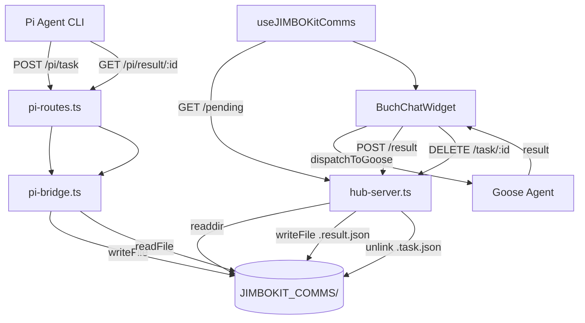

# Mapa Architektury: Pi ↔ JIMBO_kit ↔ BUCH_CHAT Integration

**Wersja:** 1.0 (Po Phase 3 completion)
**Data:** 2026-04-25

---

## 📂 STRUKTURA PLIKÓW

### Backend (JIMBO Hub)

| Plik | Linie | Cel | API/Metody |
|------|-------|-----|------------|
| `JIMBO_agent_HUB/hub-server.ts` | 1985-1997 | GET /jimbokit-comms/pending | Lista `.task.json` z JIMBOKIT_COMMS/ |
| `JIMBO_agent_HUB/hub-server.ts` | 2000-2010 | POST /jimbokit-comms/result | Zapis `.result.json` |
| `JIMBO_agent_HUB/hub-server.ts` | 2013-2022 | DELETE /jimbokit-comms/task/:id | Usuwanie przetworzonych tasków |
| `JIMBO_agent_HUB/routes/pi-routes.ts` | 7-35 | Pi Agent HTTP API | POST /pi/task, GET /pi/result/:id, GET /pi/status/:id |
| `JIMBO_agent_HUB/core/pi-bridge.ts` | 39-59 | Pi task receiver | receiveTask(), zapisuje `.task.json` |       
| `JIMBO_agent_HUB/core/pi-bridge.ts` | 60-66 | Pi result provider | getResultForPi(), czyta `.result.json` |   
| `JIMBO_agent_HUB/core/jimbokit-comms-manager.ts` | 1-140 | [LEGACY] File watcher | Używany dla .md formatów (już nie aktywny w OPCJI 1) |

### Frontend (ZENO Browser)

| Plik | Linie | Cel | Metody/Hooks |
|------|-------|-----|--------------|
| `src/components/assistant/useJIMBOKitComms.ts` | 1-58 | React hook polling | pendingTasks, completeTask() |   
| `src/components/assistant/BuchChatWidget.tsx` | 13 | Import hook | useJIMBOKitComms |
| `src/components/assistant/BuchChatWidget.tsx` | 345 | Hook usage | const { pendingTasks, completeTask } = ... |
| `src/components/assistant/BuchChatWidget.tsx` | 578-596 | Auto-processing | useEffect → processingTasks logic |
| `src/components/assistant/BuchChatWidget.tsx` | 583 | Goose delegation | dispatchToGoose(-1, task.instruction) |
| `src/components/assistant/BuchChatWidget.tsx` | 590 | Task completion | completeTask(task.id, result) |       

### Pi Agent (Workspace Constraints)

| Plik | Linie | Cel | Metody |
|------|-------|-----|--------|
| `pi-mono/packages/coding-agent/src/core/tools/path-utils.ts` | 57-114 | Workspace validation | assertWorkspaceAccess() |
| `pi-mono/packages/pi-core/src/workspace-access-control.ts` | 17-60 | Access control class | validatePath() |  
| `pi-mono/packages/pi-agent/src/pi-agent.ts` | 17-59 | CLI wrapper | ensureWorkspaceAccess() |

---

## 🔄 PRZEPŁYW DANYCH

### E2E Flow: Pi → JIMBO → BUCH → Goose → BUCH → JIMBO → Pi

```
┌─────────────┐
│  Pi Agent   │
│ (CLI/API)   │
└──────┬──────┘
       │ POST /pi/task {id, type, payload, priority}
       ▼
┌──────────────────────────────┐
│   pi-routes.ts (L7-15)      │
│   → PiBridge.receiveTask()  │
└──────────────┬───────────────┘
       │ fs.writeFile()
       ▼
┌──────────────────────────────┐     
│ JIMBOKIT_COMMS/                  │
│   {id}.task.json                 │
└──────────────┬───────────────┘     
       │ GET /jimbokit-comms/pending (polling co 5s)
       ▼
┌──────────────────────────────┐     
│ useJIMBOKitComms hook            │
│   → pendingTasks state           │
└──────────────┬───────────────┘     
       │ useEffect trigger
       ▼
┌──────────────────────────────┐     
│ BuchChatWidget.tsx (L578-596)    │
│   processingTasks logic          │
└──────────────┬───────────────┘     
       │ dispatchToGoose(task.instruction)
       ▼
┌──────────────────────────────┐     
│ Goose (via JIMBO Hub WebSocket)  │
│   ws://localhost:4224/ws         │
└──────────────┬───────────────┘     
       │ result
       ▼
┌──────────────────────────────┐     
│ completeTask(id, result)         │
│   POST /jimbokit-comms/result    │
└──────────────┬───────────────┘     
       │ fs.writeFile()
       ▼
┌──────────────────────────────┐     
│ JIMBOKIT_COMMS/                  │
│   {id}.result.json               │
└──────────────┬───────────────┘
       │ DELETE /jimbokit-comms/task/:id
       │ (cleanup .task.json)
       ▼
┌──────────────────────────────┐     
│ Pi Agent                         │
│   GET /pi/result/:id             │
│   ← {status, result, timestamp}  │
└──────────────────────────────┘     
```

---

## 📻 FORMATY DANYCH

### Task Format (.task.json)

```json
{
  "id": "test-001",
  "type": "code_analysis",
  "payload": {
    "file": "test.ts",
    "lines": "1-50"
  },
  "priority": "high",
  "timestamp": 1714000000000
}
```

### Result Format (.result.json)

```json
{
  "status": "dispatched",
  "ts": 1714000123456,
  "gooseOutput": "...",
  "metadata": {
    "processedBy": "buch-chat",
    "delegatedTo": "goose"
  }
}
```

---

## 🔌 ENDPOINTY HTTP API

### JIMBO Hub - Pi Routes

| Method | Path | Body | Response | Purpose |
|--------|------|------|----------|---------|
| POST | `/pi/task` | `PiTask` | `{success: true, taskId: string}` | Pi wysyła task |
| GET | `/pi/result/:taskId` | - | `TaskResult` | Pi odbiera wynik |
| GET | `/pi/status/:taskId` | - | `{success: true, status: string}` | Pi sprawdza status |

### JIMBO Hub - BUCH Routes

| Method | Path | Body | Response | Purpose |
|--------|------|------|----------|---------|
| GET | `/jimbokit-comms/pending` | - | `PendingTask[]` | BUCH pobiera pending tasks |
| POST | `/jimbokit-comms/result` | `{id: string, result: any}` | `{ok: true, path: string}` | BUCH zapisuje wynik |
| DELETE | `/jimbokit-comms/task/:id` | - | `{ok: true, id: string}` | BUCH usuwa przetworzony task |

---

## 📦 FOLDER JIMBOKIT_COMMS/

**Lokalizacja:** `U:\WWW_Zen_BRo_wser_org3\JIMBOKIT_COMMS\`

**Pliki:**
- `{taskId}.task.json` - Pending task (utworzony przez Pi, czytany przez BUCH)
- `{taskId}.result.json` - Result (utworzony przez BUCH, czytany przez Pi)

**Cykl życia:**
1. Pi → tworzy `.task.json`
2. BUCH → wykrywa (polling)
3. BUCH → przetwarza (deleguje do Goose)
4. BUCH → tworzy `.result.json`
5. BUCH → usuwa `.task.json` (DELETE endpoint)
6. Pi → czyta `.result.json`

---

## 🔒 WORKSPACE CONSTRAINTS (Pi Agent)

**allowedPaths:**
- `U:/The_DEVz_HUB_of_work`
- `U:/WWW_Zen_BRo_wser_tool`

**forbiddenPaths:**
- `U:/WWW_Zen_BRo_wser_org3/JIMBOKIT_COMMS` ❌
- `U:/WWW_Zen_BRo_wser_org3/JIMBO_agent_HUB` ❌
- `U:/WWW_Zen_BRo_wser_org3/src` ❌

**Komunikacja:** TYLKO przez HTTP API (`localhost:4224/pi/*`)

---

## 🗺️ DIAGRAM KOMPONENTÓW


