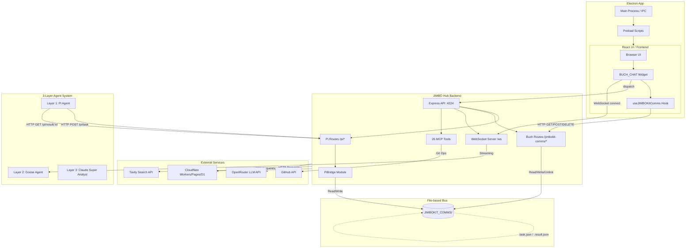

# GŁÓWNA MAPA APLIKACJI ZENO BROWSER

**Data:** 2026-04-25
**Wersja:** 1.0

---

## 1. Architektura wysokopoziomowa

Aplikacja ZENO Browser to nowoczesna, wielowarstwowa architektura oparta na technologiach webowych i desktopowych, umożliwiająca głęboką integrację z inteligentnymi asystentami i rozszerzonym środowiskiem wykonawczym AI.

**Główne warstwy aplikacji:**
- **React UI (Frontend):** Zapewnia interfejs użytkownika przeglądarki, zarządzanie kartami, panelami narzędziowymi i obszarem wyświetlania stron internetowych.
- **Electron Main (Proces Główny):** Odpowiada za integrację z systemem operacyjnym, zarządzanie cyklem życia okien, obsługę IPC (Inter-Process Communication) i bezpieczne ładowanie stron webowych (WebViews).
- **Backend Services (JIMBO Hub):** Lokalny serwer koordynujący działanie agentów, dostarczający narzędzia MCP i zarządzający przepływem danych między poszczególnymi komponentami asystenta.

**Kluczowe komponenty i ich role:**
- **Przeglądarka bazowa:** Renderowanie HTML, nawigacja.
- **System orkiestracji AI:** Przekazywanie zadań, odbieranie wyników i weryfikacja dostępów workspace'u.
- **Interfejs Asystenta (BUCH_CHAT):** Pływający widget asystenta AI obsługujący komunikację na żywo z użytkownikiem.

**Technologie:**
- React 19
- Electron 27
- Vite 5
- TypeScript 5.3
- Express (Backend)
- WebSocket (Real-time update stream)

---

## 2. System Agentów (3-warstwowy)

ZENO Browser wykorzystuje złożony system delegacji zadań (Agentic System) w celu optymalizacji obciążenia i zapewnienia wysokiej jakości wykonywanych poleceń:

- **WARSTWA 3 (Background): Claude (Super Analityk)**
  Odpowiada za najtrudniejsze zadania analityczne, generowanie głębokich raportów i rozwiązywanie skomplikowanych problemów programistycznych w tle.
- **WARSTWA 1 (Layer 1): JIMBO_kit (BOSS) ↔ Pi Agent (PRACOWNIK)**
  Pi Agent działa jako wykonawca poleceń podległy systemowi JIMBO_kit (operującemu z poziomu CLI). Skupia się na zadaniach wymagających operacji na systemie plików z ścisłymi regułami dostępu.
- **WARSTWA 2 (Layer 2): BUCH_CHAT (BOSS) ↔ Goose (PRACOWNIK)**
  Widget BUCH_CHAT zbiera i deleguje konkretne sub-taski agentowi Goose za pomocą WebSockets i HTTP API.
  
**Przepływ komunikacji:** 
Pi → JIMBO_kit → JIMBOKIT_COMMS/ → BUCH_CHAT → Goose

Więcej szczegółów w: `ARCHITECTURE_MAP.md`

---

## 3. JIMBO Hub (Backend Server)

Serwer backendowy realizujący funkcje pośrednika dla usług agentowych.

- **Lokalizacja:** `U:/WWW_Zen_BRo_wser_org3/JIMBO_agent_HUB/`
- **Main file:** `hub-server.ts` (Express server port 4224)
- **Cechy szczególne:** 
  - 26 załadowanych MCP tools, 
  - WebSocket hostowany na `ws://localhost:4224/ws` dla streamingu operacji agenta Goose.
- **HTTP API endpoints:**
  - **Pi Agent routes:** `POST /pi/task`, `GET /pi/result/:id`, `GET /pi/status/:id`
  - **BUCH routes:** `GET /jimbokit-comms/pending`, `POST /jimbokit-comms/result`, `DELETE /jimbokit-comms/task/:id`
- **Inne:** Zintegrowana baza umiejętności (Skills database), orkiestracja agentów (BUCH_AGENT).

---

## 4. Frontend React Components

Warstwa widoku stworzona z myślą o modularności, integrująca natywne interfejsy AI.

- **Kluczowe komponenty:**
  - `BrowserUI` – główny kontener aplikacji.
  - `BuchChatWidget` – widget asystenta AI zarządzający zlecaniem zadań (Layer 2 BOSS) do Goose.
  - `useJIMBOKitComms` – hook React pobierający polecenia z folderu JIMBOKIT_COMMS poprzez polling.
  - Inne główne bloki: `AddressBar`, `TabBar`, `PluginManager`.
  - Dashboard centrum dowodzenia AI: `ai-hub/index.html`.
- **Lokalizacja:** `src/components/`

---

## 5. Electron Main Process

Odpowiada za logikę systemową i zarządzanie oknami aplikacji desktopowej.

- **Lokalizacja:** `src-electron/`
- **Funkcjonalności:**
  - Definicje IPC handlers i preload scripts zapewniające bezpieczną komunikację UI z Node.js.
  - Zarządzanie oknami, menu bar.
  - Integracja zdarzeń procesów renderujących z backendowymi usługami (np. start backendu z procesem przeglądarki).

---

## 6. Komunikacja i Przepływ Danych

Aplikacja wykorzystuje hybrydowy model komunikacji:

- **IPC (Electron):** Renderer ↔ Main process (Wywoływanie natywnych operacji, np. dostęp do schowka, system plików na wyższym poziomie).
- **HTTP API:** Frontend ↔ JIMBO Hub (Express na `localhost:4224`).
- **WebSocket:** Real-time communication dla agenta BUCH ↔ Goose (`ws://localhost:4224/ws`).
- **File-based:** folder `JIMBOKIT_COMMS/` służy jako tymczasowa szyna danych dla zleceń między warstwami agentów (wymieniają pliki `.task.json`, `.result.json`).
- Diagram przepływu dostępny jest również w dokumentacji integracji (`ARCHITECTURE_MAP.md`).

---

## 7. External Integrations

ZENO Browser wykorzystuje moc chmury i zewnętrznych API w celu zwiększenia własnych kompetencji:

- **Cloudflare** (Workers, Pages, D1, R2, KV) - do hostingu i bazy wiedzy.
- **OpenRouter API** - jako główne bramki dostępu do modeli LLM.
- **GitHub** - poprzez narzędzia MCP (integracja pull/push).
- **Tavily** - potężne API do researchu w sieci.
- **Plausible/Umami** - analityka wbudowana.
- **Meilisearch** - system wyszukiwawczy.

---

## 8. Build & Deploy

Proces budowania jest zautomatyzowany za pomocą narzędzi i skryptów w ekosystemie Vite i Cloudflare.

- **Vite build system:** konfiguracja w `vite.config.mts` (wysoce zoptymalizowane buildy).
- **Electron packaging:** Budowa aplikacji .exe i macOS/Linux binarek.
- **Cloudflare Pages deployment:** konfiguracja zdefiniowana w `wrangler.pages.toml`.
- **Skrypty CI/CD / PowerShell:** `deploy_vite_to_githubpages.ps1`, `update-cf-secrets.ps1`.

---

## 9. Testing

Infrastruktura walidacyjna kodu i przepływów UI.

- **Frameworki i pliki konfiguracyjne:**
  - Jest (`jest.config.js`) do testów jednostkowych.
  - Playwright (`playwright.config.ts`) do testów E2E zachowań przeglądarki.
- **Katalogi wyjściowe logów i raportów:** `test-results/`, `playwright-report/`, `coverage/`.

---

## 10. Development Workflows

Kluczowe pliki wsadowe dla developerów pozwalające na szybki start wszystkich klocków aplikacji:

- `start_zeno.bat` - Uruchomienie głównej aplikacji (UI + Main process).
- `start_zeno_hub.bat` - Uruchomienie serwera JIMBO Hub i innych narzędzi backendowych.
- `npm start` (wewnątrz folderu `JIMBO_agent_HUB/`) - bezpośrednie uruchomienie serwera za pomocą `tsx hub-server.ts`.
- `watchdog.ps1` - Monitoring głównych procesów i auto-restart.
- `sync_devz_hub_loop.ps1` - Skrypt ciągłej synchronizacji z workspace'm deweloperskim.

---

## 11. Workspace Constraints (Pi Agent)

Pi Agent posiada ścisłe restrykcje przestrzenne i komunikacyjne:

- **allowedPaths:** `U:/The_DEVz_HUB_of_work`, `U:/WWW_Zen_BRo_wser_tool`
- **forbiddenPaths:** `U:/WWW_Zen_BRo_wser_org3/JIMBOKIT_COMMS`, `JIMBO_agent_HUB`, `src`
- **Communication:** Wyłącznie poprzez HTTP API na porcie 4224 (`localhost:4224/pi/*`).
- **Implementacja weryfikacji dostępu:** `workspace-access-control.ts`, `path-utils.ts`, `pi-agent.ts`.

---

## 12. Kluczowe Katalogi

Podsumowanie roli najważniejszych folderów w strukturze workspace'a:

- `src/` - Kod źródłowy React (frontend).
- `src-electron/` - Kod źródłowy procesu głównego Electron.
- `JIMBO_agent_HUB/` - Backendowy serwer Express z obsługą zadań MCP.
- `JIMBOKIT_COMMS/` - Folder komunikacji plikowej (Layer 1 ↔ Layer 2) - pośrednik dla zadań Pi i BUCH.
- `pi-mono/` - Monorepo aplikacji Pi Agent (fork z `badlogic/pi-mono`).
- `AGENT_LIBRARY/` - Katalog konfiguracji używanych agentów (np. `claude.json`, `pi.json`, `goose.json`).
- `WORKSPACE_META_DATA/` - Logi, mapy strukturalne projektu, raporty i zrzuty dokumentacji.
- `ai-hub/` - Standalone aplikacja HTML (Dashboard AI).
- `docs/` - Podręczniki, konfiguracje, przewodniki integracyjne.
- `memories/` - Trwała pamięć agentowa (`/memories/`, `/memories/session/`, `/memories/repo/`).
- `workers/` - Kod źródłowy i usługi Cloudflare Workers.

---

## 13. Mermaid Diagram - Architektura Całkowita

---

## 14. Index Plików Kluczowych

Poniższa tabela zawiera indeks najważniejszych plików definiujących zachowania całego systemu:

| File | Lines | Purpose | Dependencies |
|------|-------|---------|--------------|
| `src/components/assistant/BuchChatWidget.tsx` | 578-596 | Zlecanie zadań agentowi Goose na podst. pollingu oraz zarządzanie oknem konwersacji AI | `useJIMBOKitComms.ts`, `page-agent` |
| `src/components/assistant/useJIMBOKitComms.ts` | 1-58 | Okresowe asynchroniczne pobieranie pliku task.json via API oraz uderzanie do API zapisu result | `fetch`, React Hooks |
| `JIMBO_agent_HUB/hub-server.ts` | 1985-2022 | Definicje ścieżek `GET /jimbokit-comms/pending`, `POST /jimbokit-comms/result`, `DELETE /jimbokit-comms/task/:id` oraz punkt styku z WebSocketem | `express`, `ws`, Node `fs` |
| `JIMBO_agent_HUB/routes/pi-routes.ts` | 7-35 | Endpointy odpowiedzialne za akceptowanie requestów od agenta Pi | `PiBridge` |
| `JIMBO_agent_HUB/core/pi-bridge.ts` | 39-66 | Adapter systemu plików operujący bezpośrednio na `JIMBOKIT_COMMS/` (odczyt/zapis JSON) | Node `fs/promises`, `path` |
| `pi-mono/packages/pi-core/src/workspace-access-control.ts` | 17-60 | Walidacja dostępu agenta Pi do określonych zasobów (zakaz dostępu do wybranych katalogów ZENO) | Wbudowane filtry Node.js |
| `vite.config.mts` | Całość | Główne zasady budowania dla warstwy webowej (frontend) przy pomocy Vite | `vite`, `vite-plugin-electron` |
| `playwright.config.ts` | Całość | Ustawienia dla testów E2E przeprowadzanych za pomocą przeglądarki bazowej | `@playwright/test` |
